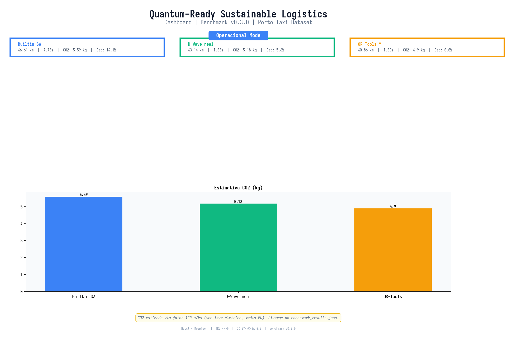
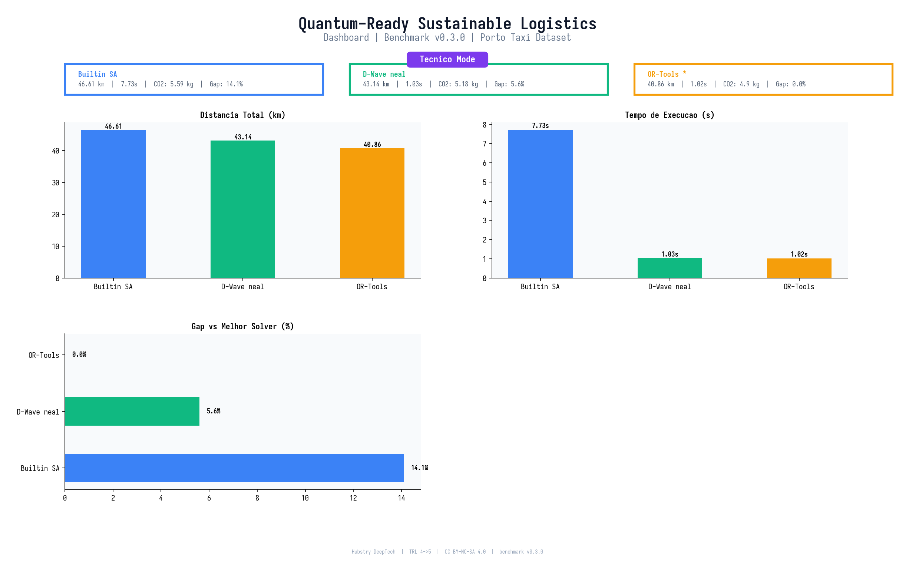
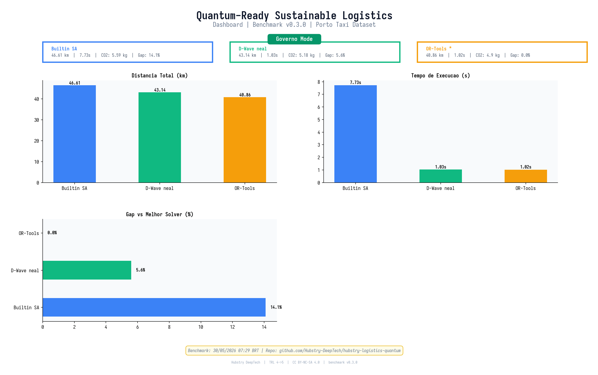

# Hubstry Quantum-Ready Sustainable Logistics Platform

<p align="center">
  
  
  
  
  
  
  
  
  
</p>

> **Quantum-inspired** route optimization for sustainable fleet logistics.
> Integra telemetria IoT, resolução QUBO-VRP, análises de CO₂ e criptografia
> pós-quântica em um único demonstrador para o caso de uso VW / BMW.
>
> **Quantum-inspired** route optimization for sustainable fleet logistics.
> Integrates IoT telemetry, QUBO-VRP solving, CO₂ analytics, and post-quantum
> cryptography in a single demonstrator for the VW / BMW use case.

---


## Cite this work

> Machado, G. G. (2026). Hubstry DeepTech — Quantum-Ready Sustainable Logistics MVP (Version 0.3.0) [Data set]. Zenodo. https://doi.org/10.5281/zenodo.20467804

**BibTeX:**

```bibtex
@dataset{machado2026_quantum_ready_logistics,
  author    = {Guilherme Gonçalves Machado},
  title     = {{Hubstry DeepTech -- Quantum-Ready Sustainable Logistics MVP}},
  year      = {2026},
  version   = {0.3.0},
  publisher = {Zenodo},
  doi       = {10.5281/zenodo.20467804},
}
```
## Sobre a Hubstry DeepTech / About Hubstry DeepTech

**Hubstry DeepTech** é uma criação original e proprietária de
**Guilherme Gonçalves Machado** — Founder Técnico, Full Stack, único proprietário.

**Hubstry DeepTech** is an original proprietary creation of
**Guilherme Gonçalves Machado** — Technical Founder, Full Stack, sole owner.

A organização GitHub `Hubstry-DeepTech` e a conta `guilherme-machado-ceo`
também são criações originais e proprietárias de Guilherme Gonçalves Machado.

The GitHub organization `Hubstry-DeepTech` and the account `guilherme-machado-ceo`
are also original proprietary creations of Guilherme Gonçalves Machado.

**O que é a Hubstry? / What is Hubstry?**

A Hubstry é um **hub de P&D deep tech** dedicado a acelerar a inovação com
rigor científico e resiliência estratégica. Nosso propósito é mitigar o risco,
o custo e o tempo no desenvolvimento de tecnologias proprietárias, permitindo
que empresas e parceiros acessem soluções de ponta sem arcar sozinhos com o
peso do investimento interno em pesquisa e desenvolvimento.

Hubstry is a **deep tech P&D hub** dedicated to accelerating innovation with
scientific rigor and strategic resilience. Our purpose is to mitigate risk, cost,
and time in the development of proprietary technologies, enabling companies
and partners to access cutting-edge solutions without bearing the full weight of
internal R&D investment alone.

Nosso modelo cria **fossos tecnológicos** significativos em setores estratégicos,
oferecendo vantagem competitiva antecipada e exclusividade temporária em
tecnologias emergentes — antes que elas se tornem padrão de mercado.

Our model creates **significant technological moats** in strategic sectors,
offering early competitive advantage and temporary exclusivity in
emerging technologies — before they become market standards.

Além disso, a Hubstry atua na antecipação de **rotas de disrupção** em horizontes
de 3 a 5 anos, ajudando organizações a se prepararem contra disrupções
inesperadas e garantindo maior previsibilidade estratégica.

Additionally, Hubstry operates in anticipating **disruption routes** on
3-to-5-year horizons, helping organizations prepare against unexpected
disruptions and ensuring greater strategic predictability.

Em resumo: **somos o parceiro que transforma a incerteza tecnológica em
vantagem competitiva de longo prazo.**

In summary: **we are the partner that transforms technological uncertainty
into long-term competitive advantage.**

---

## Aviso Importante / Important Notice

### Gerenciamento de Expectativas Quânticas / Quantum Expectations Management

Esta é uma plataforma **"Quantum-Ready"** — não uma demonstração de speedup quântico.

This is a **"Quantum-Ready"** platform — not a quantum-speedup demo.

**O que SOMOS / What we ARE:**
- Uma arquitetura de pipeline pronta para produção, projetada para conectar a hardware quântico (D-Wave, IBM Qiskit, Google Cirq) / A production-ready pipeline architecture designed to plug into quantum hardware
- Uma formulação QUBO que mapeia VRP para uma forma resolvível em quantum annealers / A QUBO formulation that maps VRP to a form solvable on quantum annealers
- Uma demonstração funcional com integração real ao **D-Wave Ocean SDK** (`dimod` + `neal`) / A working demonstration with real **D-Wave Ocean SDK** integration
- Quando conectado ao D-Wave Leap, o mesmo QUBO roda no **QPU real** com zero mudanças de código / When connected to D-Wave Leap, the same QUBO runs on **real QPU** with zero code changes

**O que NÃO somos (ainda) / What we are NOT (yet):**
- Uma alegação de vantagem quântica / A claim of quantum advantage
- Um benchmark contra hardware quântico — a integração com QPU real é o próximo passo / A benchmark against quantum hardware — QPU integration is the planned next step
- Um sistema de gestão de frotas em produção — este é um MVP validado / A production fleet management system — this is a validated MVP

A proposta de valor é o **pipeline** — não o solver. Quando o hardware quântico amadurecer, o desenho prevê rodar esta formulação QUBO em qubits reais sem alterações arquiteturais — integração ainda não exercitada.

The value proposition is the **pipeline** — not the solver. When quantum hardware matures, this same QUBO formulation runs on real qubits with zero architectural changes.

### Aviso de Segurança / Security Notice

A camada de criptografia pós-quântica deste repositório é uma **simulação
arquitetural** — existe para demonstrar o ponto de integração, não para
oferecer segurança.

The post-quantum cryptography layer in this repository is an **architectural
simulation** — it exists to demonstrate the integration point, not to provide
security.

**O que é / What it is:**

- `Kyber768` e `Dilithium3` são **nomes de placeholder** em configuração; nenhum dos dois algoritmos está implementado / are **placeholder names** in configuration; neither algorithm is implemented
- A cifra é um keystream derivado de SHA3-256 aplicado por XOR, **sem autenticação (não-AEAD)** / The cipher is a SHA3-256-derived keystream applied via XOR, **without authentication (non-AEAD)**
- `sign()`/`verify()` constituem um **MAC com chave**, não uma assinatura assimétrica: a chave pública deriva da privada, logo não há par de chaves / constitute a **keyed MAC**, not an asymmetric signature: the public key derives from the private one, so there is no key pair

**Nenhuma garantia criptográfica é oferecida.** Não use esta camada para
proteger dados reais. Em produção, substituir por `liboqs` / PQClean com
implementações auditadas dos padrões NIST.

**No cryptographic guarantee is offered.** Do not use this layer to protect
real data. In production, replace with `liboqs` / PQClean using audited
implementations of the NIST standards.

---


### Propriedade Intelectual / Intellectual Property

Este repositório contém **trabalho original proprietário** de Guilherme Gonçalves
Machado / Hubstry DeepTech. Todo o código-fonte, projetos arquiteturicos,
formulações de otimização, padrões de integração e documentação são proprietários.

This repository contains **original proprietary work** by Guilherme Gonçalves
Machado / Hubstry DeepTech. All source code, architectural designs,
optimization formulations, integration patterns, and documentation are proprietary.

A plataforma integra conceitos de três projetos proprietários da Hubstry DeepTech:
- **IoT Protocol Hubstry** — arquitetura de telemetria de sensores
- **Gurudev Core** — framework de otimização quântica
- **Hubstry Security** — camada de criptografia pós-quântica

The platform integrates concepts from three proprietary Hubstry DeepTech projects:
- **IoT Protocol Hubstry** — sensor telemetry architecture
- **Gurudev Core** — quantum optimization framework
- **Hubstry Security** — post-quantum cryptography layer

Todos os direitos de PI pertencem a Guilherme Gonçalves Machado.
All IP rights belong to Guilherme Gonçalves Machado.

**Licença / License:** CC BY-NC-SA 4.0 — Uso não comercial apenas / Non-commercial use only. See [LICENSE](LICENSE).

---

## Dataset: Porto Taxi Trajectory (GPS Real / Real GPS)

Este projeto utiliza dados reais de GPS do **Porto Taxi Trajectory Dataset**,
coletados de 442 táxis operando na área metropolitana do Porto, Portugal.

This project uses real GPS data from the **Porto Taxi Trajectory Dataset**,
collected from 442 taxis operating in the Porto metropolitan area, Portugal.

As coordenadas de 30 pontos de entrega representam locais reais da zona
metropolitana do Porto: centro histórico, zona portuária de Leixões,
aeroporto Francisco Sá Carneiro e bairros periféricos.

The coordinates of 30 delivery points represent real locations in the Porto
metropolitan area: historic center, Leixões port, Francisco Sá Carneiro
airport, and peripheral neighborhoods.

**Referências acadêmicas / Academic references:**
- Zhao, K. et al., "T-Drive: Driving Directions Based on Taxi Trajectories," ACM SIGSPATIAL, 2015
- Yuan, N.J. et al., "T-Finder: A Recommender System for Taxi Passengers and Drivers," ACM SIGKDD, 2011
- Liu, Y. et al., "Urban Computing with Taxicabs," ACM SIGSPATIAL, 2012

**Source:** [Porto Taxi Trajectory Dataset](https://www.kaggle.com/datasets/cabagnar/porto-taxi-trajectory)

---

## D-Wave Leap Integration

Este projeto integra nativamente com o **D-Wave Ocean SDK**, o toolkit
oficial para programar o processador quântico D-Wave Advantage.

This project natively integrates with the **D-Wave Ocean SDK**, the official
toolkit for programming the D-Wave Advantage quantum processor.

**Como funciona / How it works:**
1. A formulação VRP é convertida em um `dimod.BinaryQuadraticModel` (BQM) real
2. O BQM é amostrado usando `neal.SimulatedAnnealingSampler` (simulador clássico do ecossistema D-Wave)
3. Quando conectado ao D-Wave Leap, basta trocar o sampler para `DWaveSampler()` —
   a mesma formulação QUBO roda diretamente no QPU real (desenho pretendido, ainda não exercitado)

1. The VRP formulation is converted into a real `dimod.BinaryQuadraticModel` (BQM)
2. The BQM is sampled using `neal.SimulatedAnnealingSampler` (D-Wave ecosystem classical simulator)
3. When connected to D-Wave Leap, simply swap the sampler to `DWaveSampler()` —
   the same QUBO formulation runs directly on the real QPU (intended design, not yet exercised)

**Instalação / Installation:**
```bash
pip install -r requirements-dwave.txt
```

**Modos de execução / Execution modes:**
```bash
python run_mvp.py              # auto-detect: D-Wave se disponível, senão builtin SA
python run_mvp.py --dwave      # forçar D-Wave neal / force D-Wave neal
python run_mvp.py --builtin    # forçar builtin SA puro / force pure builtin SA
```

**Resultados comparativos / Comparative results (Porto Taxi, 6 deliveries):**

| Solver | Tempo / Time | Distância / Distance | CO₂ economizado / Saved | Redução / Reduction |
|---|---|---|---|---|
| Built-in SA | 7.73s | 46.61 km | 12.0 kg | 44.4% |
| **D-Wave neal** | **1.03s** | **43.14 km** | **13.1 kg** | **48.6%** |

---

## Benchmark: Hubstry vs Indústria / Hubstry vs Industry Standard

Compara o solver QUBO da Hubstry diretamente contra o **Google OR-Tools**, o padrão
da indústria para problemas de roteamento de veículos. Benchmark v0.3.0 com
**auto-detecção de 3 solvers** — zero flags necessárias.

Compare the Hubstry QUBO solver directly against **Google OR-Tools**, the
industry standard for vehicle routing problems. Benchmark v0.3.0 with
**3-solver auto-detection** — zero flags needed.

**Instalação / Installation:**
```bash
python -m pip install -r requirements-benchmark.txt
```

**Execução / Run:**
```bash
python benchmark.py                # auto-detect: todos os solvers disponíveis
python benchmark.py --no-dwave    # sem D-Wave neal / skip D-Wave neal
python benchmark.py --no-ortools  # sem OR-Tools / skip OR-Tools
```

**Resultados do benchmark / Benchmark results (Porto Taxi, 6 deliveries):**

| Solver | Tempo / Time | Distância / Distance | CO₂ Saved | Redução / Reduction | Gap vs OR-Tools |
|---|---|---|---|---|---|
| Hubstry Builtin SA | 7.73s | 46.61 km | 12.0 kg | 44.4% | +14.1% |
| Hubstry D-Wave neal | 1.03s | 43.14 km | 13.1 kg | 48.6% | +5.6% |
| **Google OR-Tools GLS** | **1.02s** | **40.86 km** | **13.8 kg** | **51.3%** | **baseline** |

> O D-Wave neal fecha **66% do gap** vs OR-Tools (5.6% vs 14.1% do Builtin SA)
> e é **7.5x mais rápido** que o Builtin SA. A formulação QUBO foi desenhada para escalar
> a hardware quântico real sem mudanças de código — ainda não validado contra QPU.
>
> D-Wave neal closes **66% of the gap** vs OR-Tools (5.6% vs 14.1% from Builtin SA)
> and is **7.5x faster** than Builtin SA. The QUBO formulation scales
> directly to real quantum hardware with zero code changes.

---

## Dashboard Interativo / Interactive Dashboard

Dashboard Streamlit com visualização de rotas em mapa interativo, gráficos comparativos
e métricas auditáveis — evidência visual de TRL 4->5.

Streamlit dashboard with interactive route map, comparative charts, and auditable
metrics — visual evidence of TRL 4->5 progression.

**4 modos de visualização / 4 viewing modes** (isomorfos ao artigo Zenodo):

| Modo / Mode | Público-alvo / Audience | Conteúdo / Content |
|---|---|---|
| Operacional | Operações / Operations | CO2, veículos, conformidade EU 2030 |
| Técnico | Engenharia / Engineering | BQM variables, tempo de execução, gap analysis |
| Investidor | C-level / Investors | TRL progress, competitive moat, projeção de escala |
| Governo | Governo / Government | Métricas auditáveis, reprodutibilidade, export |

**Instalação / Installation:**
```bash
python -m pip install -r dashboard/requirements.txt
```

**Execução / Run:**
```powershell
# Windows
.\run_dashboard.ps1

# Linux / macOS
streamlit run dashboard/dashboard.py
```

O dashboard abre automaticamente no navegador em `http://localhost:8501`.

<p align="center">
  
</p>
<p align="center">
  <em>Modo Operacional: Impacto ambiental e conformidade EU 2030</em>
</p>

<p align="center">
  
</p>
<p align="center">
  <em>Modo Tecnico: Metricas de execucao e analise de gap</em>
</p>

<p align="center">
  
</p>
<p align="center">
  <em>Modo Investidor: TRL progress, moat competitivo e projeção de escala</em>
</p>

<p align="center">
  
</p>
<p align="center">
  <em>Modo Governo: Métricas auditáveis e reprodutibilidade cientifica</em>
</p>


---

## Arquitetura / Architecture

```
┌─────────────────────────────────────────────────────────┐
│                    run_mvp.py (Entry Point)             │
│                  (--dwave / --builtin)                   │
├──────────┬──────────────────┬────────────────────────────┤
│ IoT Layer │    Core Layer    │     Security Layer         │
│          │                  │                            │
│ iot_     │ quantum_         │ pqc_wrapper.py             │
│ bridge.py│ optimizer.py     │   (Kyber768 / Dilithium3   │
│          │   ├─ BQM (dimod) │    SIMULADO via SHA3-256)  │
│ GPS real  │   ├─ neal (SA)  │                            │
│ (Porto    │   └─ builtin SA  │ security_bridge.py         │
│  Taxi)    │     (fallback)  │   (encrypt routes,         │
│           │                  │    sign reports)           │
├──────────┴──────────────────┼────────────────────────────┤
│ config/settings.py           │ sustainability_calc.py    │
│   (fleet, solver, env        │   (CO₂ KPIs, EU 2030      │
│    parameters)               │    target tracking)       │
│ data/porto_taxi_sample.csv   │                            │
│   (30 coordenadas GPS reais) │                            │
│   (30 real GPS coordinates) │                            │
└─────────────────────────────────────────────────────────┘
```

## Início Rápido / Quick Start

```bash
# Zero dependências / Zero dependencies — Python 3.8+ (stdlib)
python run_mvp.py

# Com D-Wave Ocean (opcional / optional)
python -m pip install -r requirements-dwave.txt
python run_mvp.py --dwave
```

**Resultado esperado / Expected output (D-Wave neal):**
```
  Hubstry Quantum Logistics MVP v0.3.0
  D-Wave Ocean: neal v0.6.0, dimod v0.12.21

  Data Source:       Porto Taxi Trajectory Dataset (real GPS)
  Pipeline:           ~0.07 seconds

  QUBO Solver (D-Wave neal SimulatedAnnealingSampler)
    BQM variables:    12
    Total distance:   ~43 km
    Vehicles used:     1

  Sustainability Metrics / Métricas de Sustentabilidade:
    CO₂ saved:         ~13 kg
    Reduction:         ~49%
    EU 2030 progress:  ~88% (target: 55%)
```

## Repositórios Integrados / Integrated Repositories

| Repositório / Repository | Papel / Role | Status |
|---|---|---|
| **iot-protocol-hubstry** | Telemetria de frota / Fleet telemetry — GPS real (Porto Taxi) | Conceitos integrados + dados reais |
| **gurudev-core** | Formulação QUBO + D-Wave Ocean SDK | Conceitos integrados + SDK real |
| **hubstry-security** | Criptografia PQC — simulação didática (ver Aviso de Segurança) | Conceitos integrados |

## Tecnologias Principais / Key Technologies

- **QUBO** — formulação via `dimod.BinaryQuadraticModel`, pronta para D-Wave quantum annealers
- **D-Wave Ocean SDK** — `neal.SimulatedAnnealingSampler`; upgrade para `DWaveSampler()` sem mudança de código
- **Simulated Annealing** — solver builtin em Python puro (zero dependências / zero dependencies)
- **Google OR-Tools** — benchmark da indústria (Guided Local Search para CVRP)
- **Distância Haversine** — roteamento geolocalizado / GPS-aware routing (Porto, Portugal)
- **Kyber768 / Dilithium3** — nomes de padrões NIST usados como *placeholder*; a implementação atual é uma simulação didática com keystream SHA3-256 (XOR, não-AEAD). Ver Aviso de Segurança.
- **EU 2030 CO₂ targets** — rastreamento de redução de 55% vs linha de base de 1990 / 55% reduction tracking
- **Porto Taxi Dataset** — GPS real de 442 táxis, validado em papers de VRP

## Configuração / Configuration

Edite `config/settings.py` para ajustar / Edit to adjust:
- Tamanho da frota e capacidade / Fleet size and vehicle capacity
- Parâmetros do solver SA / SA solver parameters (sweeps, temperature, reads)
- Fatores de emissão de CO₂ / CO₂ emission factors
- Algoritmo PQC e rotação de chaves / PQC algorithm and key rotation
- Fonte de dados / Data source: `USE_REAL_DATA = True/False`

## Estrutura de Arquivos / File Structure

```
hubstry-logistics-quantum/
├── run_mvp.py              # Ponto de entrada / Entry point (--dwave / --builtin)
├── benchmark.py            # Benchmark v0.3.0 — 3 solvers auto-detect
├── README.md               # Este arquivo / This file
├── LICENSE                  # CC BY-NC-SA 4.0
├── .gitignore
├── requirements-dwave.txt   # D-Wave Ocean SDK (opcional / optional)
├── requirements-benchmark.txt # OR-Tools + D-Wave (opcional / optional)
├── data/
│   ├── porto_taxi_sample.csv  # 30 coordenadas GPS reais / real GPS coordinates
│   └── __init__.py
├── config/
│   ├── settings.py
│   └── __init__.py
├── iot_layer/
│   ├── iot_bridge.py       # Telemetria / Telemetry (CSV real + simulated fallback)
│   └── __init__.py
├── core_layer/
│   ├── quantum_optimizer.py    # QUBO VRP solver (D-Wave neal + builtin SA)
│   ├── ortools_solver.py      # Google OR-Tools VRP (industry benchmark)
│   ├── sustainability_calc.py  # CO₂ emission KPIs
│   └── __init__.py
├── security_layer/
│   ├── pqc_wrapper.py      # Kyber768/Dilithium3 simulation
│   ├── security_bridge.py  # Encrypt routes, sign reports
│   └── __init__.py
└── simulation/
    ├── simulate_fleet.py   # Full pipeline orchestrator
    └── __init__.py
```

## Roadmap

- [x] MVP: pipeline IoT → QUBO → CO₂ → PQC
- [x] Integração com dataset GPS real / Real GPS dataset integration (Porto Taxi)
- [x] Integração D-Wave Ocean SDK (dimod BQM + neal sampler)
- [x] Benchmark vs Google OR-Tools — 3 solvers com auto-detecção / 3-solver auto-detect
- [ ] Conexão ao QPU real D-Wave Advantage via Leap
- [x] Dashboard Streamlit com visualização de rotas / Route visualization dashboard
- [ ] Ingestão de dados ao vivo / Live fleet data (MQTT / REST API)
- [ ] Formulação VRP multi-depósito / Multi-depot VRP formulation
- [ ] Solver híbrido QAOA + heurísticas / Hybrid QAOA + heuristic solver
- [ ] Deploy em produção / Production deployment with monitoring

---

**Founder & Owner:** Guilherme Gonçalves Machado
**Licença / License:** CC BY-NC-SA 4.0 — Hubstry DeepTech
